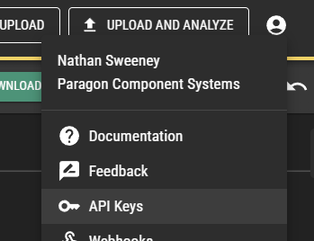

# Getting started
1. clone this repo
1. install dotnet (https://dotnet.microsoft.com/en-us/download)
1. Update Program.cs with AssemblyGroupGuid and ApiToken
    - AssemblyGroupGuid can be found at https://production.paragontruss.com/assembly-groups/{guid}. For example, https://production.paragontruss.com/assembly-groups/0b0112b4-7262-46c1-9ec0-a439ab0f33d0 where `0b0112b4-7262-46c1-9ec0-a439ab0f33d0` is the guid
    - ApiToken can be found at https://design.paragontruss.com/ by adding an API token to your user account.
    
1. run the script in a terminal with command `dotnet run` from the root of the folder it was cloned. This should be the same folder that FileDownloadApp.csproj resides.